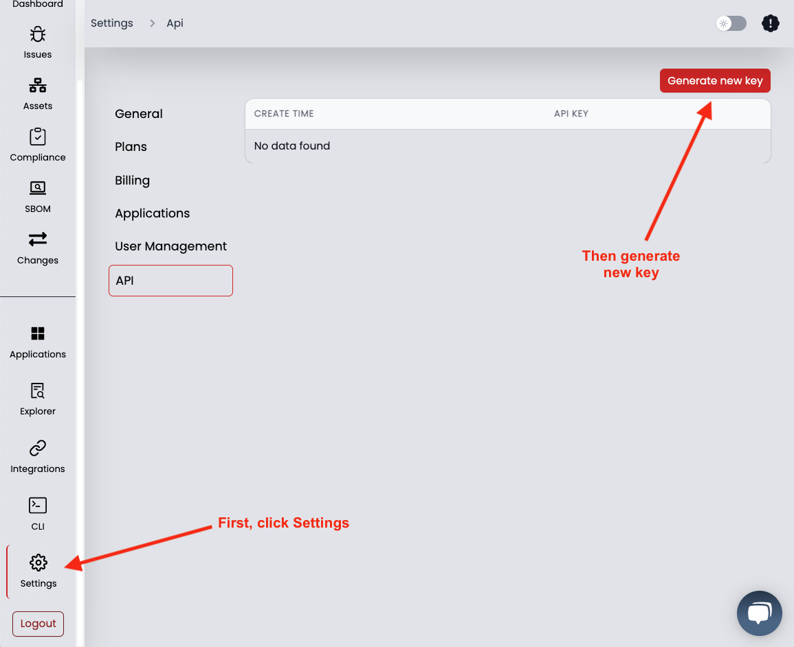
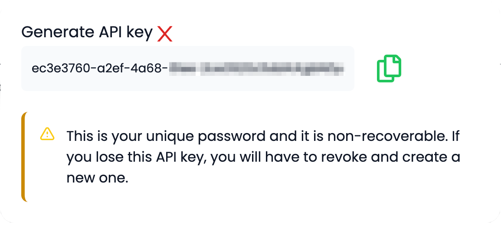
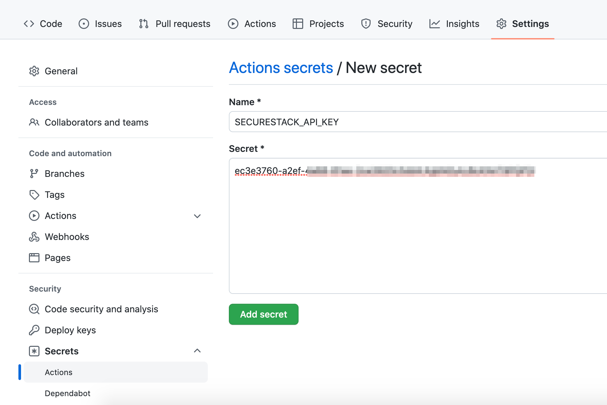
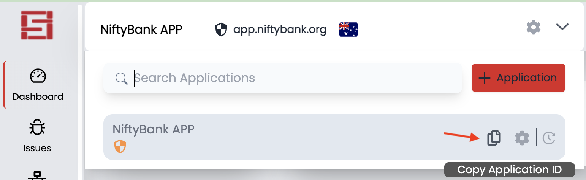
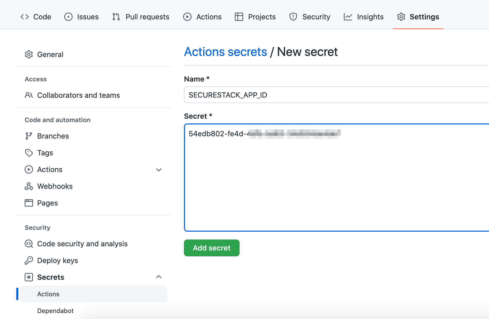
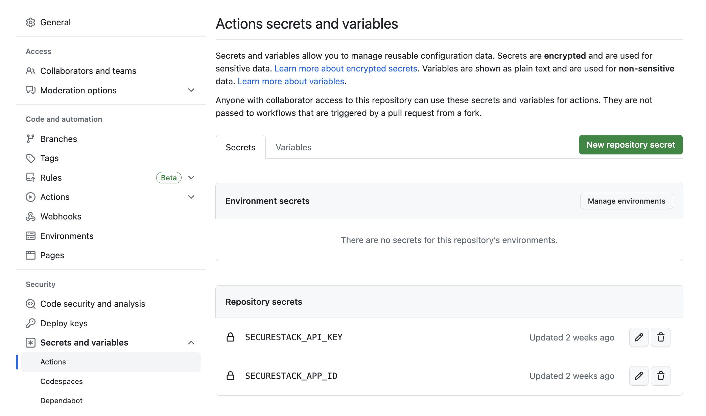
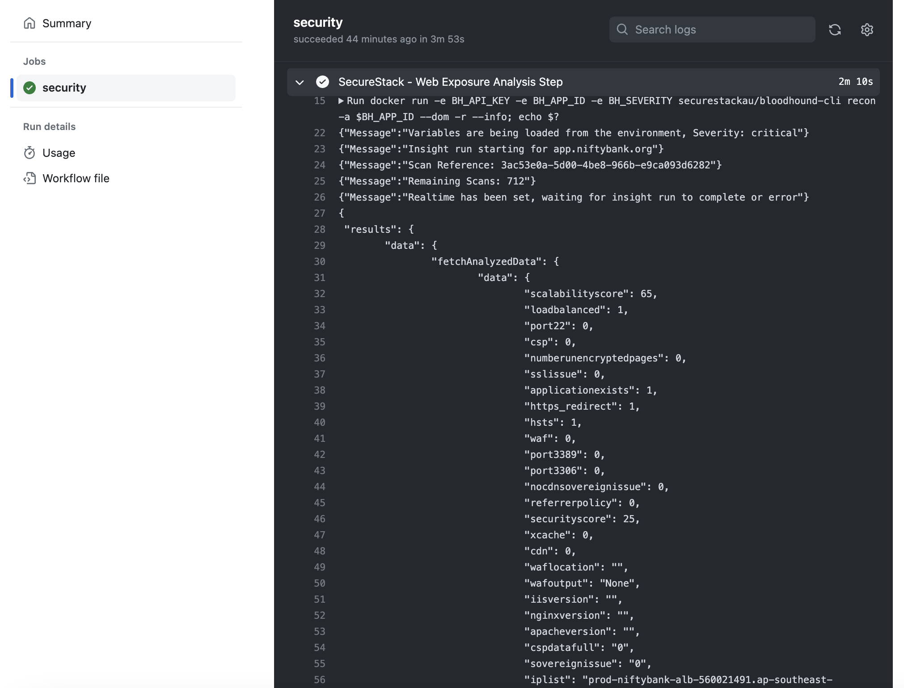
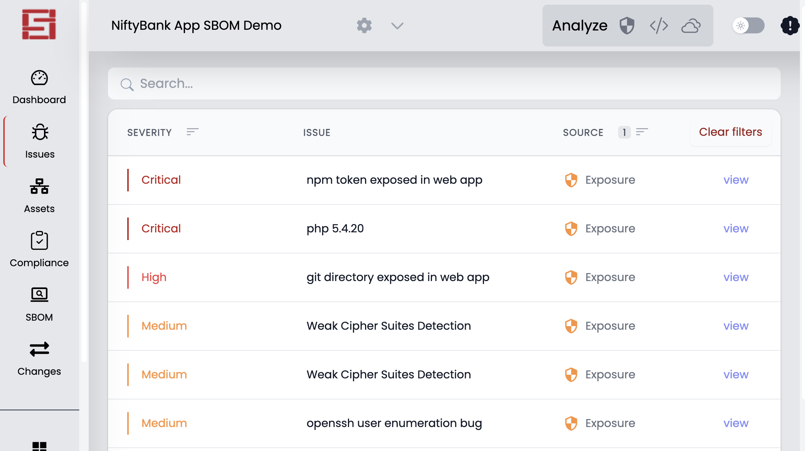

# SecureStack Web Vulnerability Analysis GitHub Action

A GitHub Action that analyses your web application for security and availability issues.
When you add this to GitHub Actions we will analyze your web app everytime you deploy to a 
public endpoint and let you know if what you've just deployed is secure and meets your 
requirements.  See below for what types of issues this action scans for.

```
name: Example Workflow Using SecureStack Web Vulnerability Exposure Action
on: push
jobs:
  security:
    runs-on: ubuntu-latest
    steps:
      - name: Web Vulnerability Exposure Analysis Step
        id: exposure
        uses: SecureStackCo/actions-exposure@v0.1.3
        with:
          securestack_api_key: ${{ secrets.SECURESTACK_API_KEY }}
          securestack_app_id: ${{ secrets.SECURESTACK_APP_ID }}
          severity: critical
          flags: '--dom -r'
```

NOTE - to understand possible values for the action input `flags`, run the SecureStack cli locally:

`$ bloodhound-cli recon --help`

## Create your SecureStack API Key as GitHub Secret

1. Create a [SecureStack](https://app.securestack.com) account using your GitHub credentials.  You get 20 scans for free and you don't need to add a credit card.
2. Once you are logged in go to "Settings" in the black drawer on the left, and then -> API tab.
3. Generate an API key and copy the value.
4. Go to Settings for your GitHub repository and click on Secrets -> Actions at the bottom left.
5. Create a new secret named SECURESTACK_API_KEY and paste the value from step 2 into the field.

## Retreiving your SecureStack Application ID

1. Log in to [SecureStack](https://app.securestack.com).
2. Open the application you wish to analyse.  If you haven't created a managed application you can follow the directions in this [VIDEO](https://youtu.be/mapgawLMVKg) to create one.  
3. Copy the value of the application id on the View Application screen.
4. Go to Settings for your GitHub repository and click on Secrets -> Actions at the bottom left.
5. Create a new secret named SECURESTACK_APP_ID and paste the value from step 3 into the field.

## Watch this video to learn how to setup your first GitHub Action with SecureStack
[](http://www.youtube.com/watch?v=0sYXsCmY2es "Video Title")


NOTE - to understand possible values for the action input `flags`, run the SecureStack cli locally:

`$ bloodhound-cli code --help`

## Create your SecureStack API Key and save as GitHub Secret

1. Log in to [SecureStack](https://app.securestack.com) with your GitHub credentials.
2. Go to Settings in the lower left corner, and then select the 6th tab: API.
3. Generate a new API key and copy the value.
4. Now back in GitHub, go to Settings for your GitHub repository and click on Secrets, and then Actions at the bottom left.
5. Create a new secret named SECURESTACK_API_KEY and paste the value from step 2 into the field and click "Add secret".

## Retreiving your SecureStack Application ID

1. Log in to [SecureStack](https://app.securestack.com).
2. In the application drop down at the top left choose the application you want to use and click on "Copy Application ID" 
3. Create a new secret named SECURESTACK_APP_ID and paste the value from step 2 into the field and click "Add secret".
4. When completed the two GitHub Secrets should look like this

## What vulnerabilities do we find?
1. Scans web application for out of date and vulnerable application components
2. Identifies whether basic security controls like WAF, firewalls, and security headers are being used
3. Finds all public facing assets & helps you understand your application attack surface
4. Identifies misconfigurations in existing WAF or CDN
5. Identifies if app is using CSP or security headers and whether they're working
6. Finds WAF bypass attacks for Akamai, Cloudflare & Imperva

## How can I see the output of the web exposure analysis?
1. You can view the analysis output right in the GitHub Action workflow output
2. You can run a local secrets analysis with our [bloodhound-cli : ](https://app.securestack.com/download-cli)
``` bloodhound-cli recon -r -a <app_id> ```

3. You can interact with the analysis output in the SecureStack SaaS 

## Check out our other GitHub Actions:
1. [SecureStack Software Composition Analysis (SCA)](https://github.com/marketplace/actions/securestack-application-composition-analysis) - Scan your application for vulnerable third-party and open source libraries.
2. [SecureStack Secret Scanning](https://github.com/marketplace/actions/securestack-secrets-analysis) - Scan your application for embedded api keys, credentials and senstive data.
3. [SecureStack Web Vulnerability & Cloud Misconfiguration Analysis](https://github.com/marketplace/actions/securestack-web-vulnerability-analysis) - Scan your running application url for cloud misconfigurations and web vulnerabilities.
4. [SecureStack Log4j Analysis](https://github.com/marketplace/actions/securestack-log4j-vulnerability-analysis) - Scan your application for Log4j/Log4Shell vulnerabilities.
5. [SecureStack SBOM](https://github.com/marketplace/actions/securestack-sbom) - Create a software bill of materials (SBOM) for your application.
6. Or, our [All-in-One GitHub Action](https://github.com/marketplace/actions/securestack-all-in-one-github-action) - We've put all of our actions together into one "Action to rule them ALL"!

Made with 💜  by [SecureStack](https://securestack.com)
